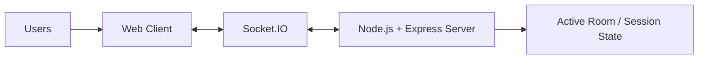
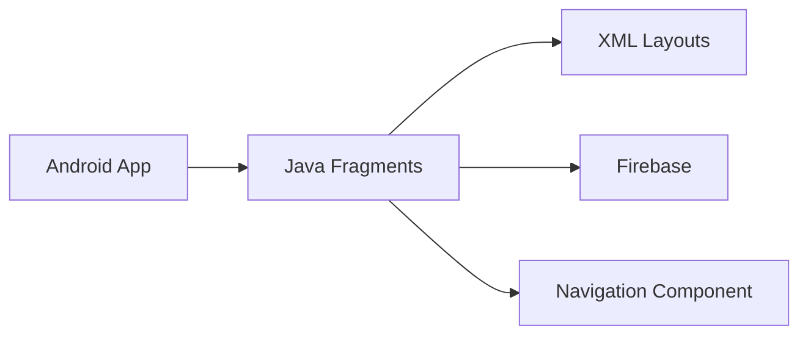

# Hungry But Indecisive?

**HBI** is a real-time collaborative food decision-making application designed to help groups decide what to eat without the usual back-and-forth.

Users join a shared room, select cuisines, rate food items, and receive a synchronized ranked list of the group's top choices.

The project contains two client implementations:

- **Web** - HTML, CSS, JavaScript, Node.js, Express.js and Socket.IO
- **Android** - Native Android using Java/XML with Firebase

## Features

- Create or join a shared room
- Real-time multiplayer collaboration
- Unique room IDs for joining sessions
- Collaborative cuisine selection
- Food-item rating using a slider
- Synchronized session state
- Player/lobby tracking
- Aggregation of ratings across participants
- Ranked final food results
- Play-again flow
- Android mobile application

## How It Works

```text
Create / Join Room
        ↓
   Waiting Lobby
        ↓
   Select Cuisines
        ↓
   Select Food Items
        ↓
    Rate Items
        ↓
 Aggregate Group Ratings
        ↓
   Rank Food Items
        ↓
   Display Results
```

The goal is to turn an otherwise unstructured group decision into a short, collaborative game-like process.

## Project Architecture

### Web

The web application uses a client-server architecture with Socket.IO providing real-time communication.



**Client**
- HTML5
- CSS
- JavaScript

**Server**
- Node.js
- Express.js

**Real-time communication**
- Socket.IO

The server manages room state, players, game flow and result aggregation while Socket.IO synchronizes events between connected clients.

### Android

The Android application provides the same HBI flow through a native mobile interface.



The Android implementation is organized around fragments for the main stages of the HBI flow:

```text
Home
  ↓
Waiting
  ↓
Cuisine Selection
  ↓
Food Rating
  ↓
Results
```

## Technology Stack

| Area | Web | Android |
|---|---|---|
| UI | HTML, CSS, JavaScript | Java, XML |
| Application logic | Node.js, Express.js | Java |
| Real-time / backend data | Socket.IO + server session state | Firebase |
| Navigation | Client-side application flow | Android Navigation Component |
| Build / dependencies | npm | Gradle |

## Repository Structure

```text
hbi-unified/
├── web/
│   ├── public/
│   │   ├── css/
│   │   ├── images/
│   │   └── js/
│   ├── package.json
│   ├── package-lock.json
│   └── server.js
│
├── mobile/
│   ├── app/
│   │   ├── src/
│   │   │   ├── androidTest/
│   │   │   ├── main/
│   │   │   │   ├── java/
│   │   │   │   └── res/
│   │   │   └── test/
│   │   └── build.gradle.kts
│   ├── gradle/
│   ├── build.gradle.kts
│   ├── gradle.properties
│   ├── gradlew
│   └── settings.gradle.kts
│
├── .gitignore
└── README.md
```

## Running the Web Application

### Requirements

- Node.js
- npm

### Setup

```bash
cd web
npm install
```

### Start

```bash
node server.js
```

The server starts on the port configured by the application.

Open the corresponding localhost address in a browser.

## Running the Android Application

### Requirements

- Android Studio
- Android SDK
- JDK compatible with the project's Gradle/Android configuration
- Firebase project configuration

Open the `mobile/` directory directly in Android Studio.

Android Studio will recognize it as the Gradle project.

### Firebase Configuration

`google-services.json` is intentionally excluded from Git.

Before building the Android application, obtain the Firebase configuration for the project and place it at:

```text
mobile/app/google-services.json
```

Then sync the Gradle project in Android Studio and build/run the application.

Do **not** commit `google-services.json` to the repository.

## Android Code Organization

The main application code is organized under:

```text
mobile/app/src/main/java/com/example/hbi/
├── MainActivity.java
├── HomeFragment.java
├── WaitingFragment.java
├── CuisineFragment.java
├── RatingFragment.java
├── ResultsFragment.java
│
├── adapter/
│   ├── PlayerAdapter.java
│   └── ResultAdapter.java
│
└── model/
    ├── Player.java
    └── Result.java
```

XML layouts define the corresponding application screens and list items, while `nav_graph.xml` defines navigation between the main fragments.

## Web Code Organization

The web implementation is organized around:

```text
web/
├── public/
│   ├── css/
│   │   └── style.css
│   ├── images/
│   ├── index.html
│   └── js/
│       └── app.js
│
├── server.js
├── package.json
└── package-lock.json
```

`server.js` handles the server-side application and multiplayer state, while the files under `public/` provide the browser interface.

## Results

The implemented HBI workflow supports the complete decision process from lobby creation through collaborative selection, rating aggregation and final result display.

The original project was designed around rooms supporting multiple concurrent users, with the documented web implementation supporting up to 8 users per room.

## Future Scope

Possible extensions include:

- Persistent database integration for global sessions and data
- Food delivery or restaurant integration
- Timers and additional host controls
- Filtering results by factors such as price or distance
- Further improvements to the mobile experience

## Project Documentation

The project was developed and documented through Software Engineering and Mobile Application Development work.

The documentation covers:
- Problem statement and research gaps
- Project scope
- System architecture
- UML and data-flow diagrams
- Web implementation
- Android implementation
- User interface
- Results and future scope

## Author

**Shreshtha Bindal**

B023

## License

This project was developed as an academic project. No open-source license is currently specified.
