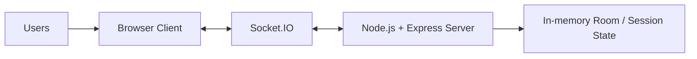
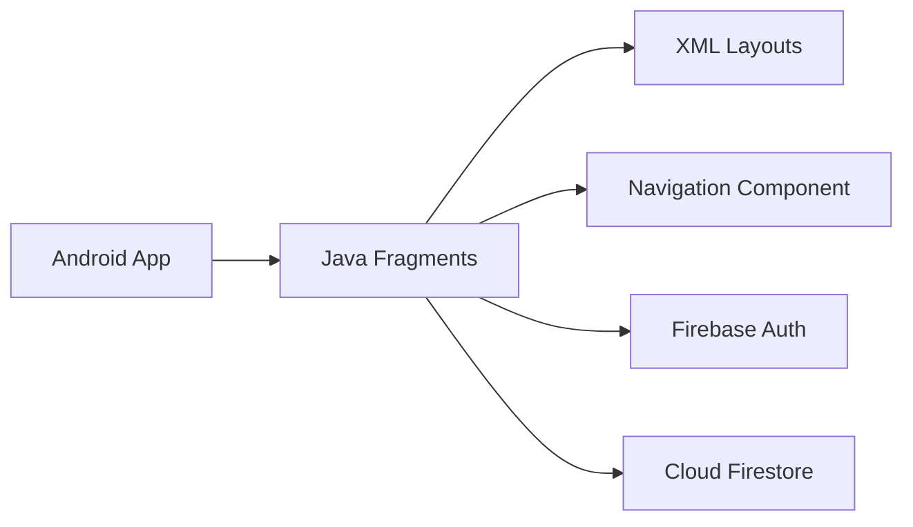

# HBI — Hungry But Indecisive

**HBI** is a real-time collaborative decision-making application that helps a group
decide what to eat without the usual back-and-forth.

Users create or join a shared room, pick cuisines together, rate the options on a
slider, and the group's ratings are aggregated into a single synchronized ranked
result that everyone sees at the same time.

The goal is to turn an otherwise unstructured group decision into a short,
collaborative, game-like process.

## The three implementations

This repository holds **three independent implementations of the same product**, built
on deliberately different architectures:

| | Implementation | Stack | Directory |
|---|---|---|---|
| 1 | **HBI Web** | HTML/CSS/JS + Node.js + Express + Socket.IO | [`web/`](web/) |
| 2 | **HBI Mobile** | Native Android (Java/XML) + Firebase | [`mobile/`](mobile/) |
| 3 | **HBI Cloud** | React/Vite + Spring Boot microservices + Kafka + Docker | [`cloud/`](cloud/) |

Web and Mobile are self-contained client applications. Cloud is a separate
cloud-native rebuild — it reuses HBI's business logic, cuisine vocabulary, food imagery
and branding, but shares no code with the other two and does not depend on them.

One difference is worth stating up front, because it changes what the app decides:
**Web and Mobile rate individual food items**, while **Cloud rates restaurants**,
scoring them against the group's cuisine, budget and distance preferences.

## Shared flow

```text
Create / Join Room
        ↓
   Waiting Lobby
        ↓
   Select Cuisines
        ↓
  Select / Shortlist
        ↓
      Rate
        ↓
 Aggregate Group Ratings
        ↓
   Ranked Results
```

## Features

- Create or join a shared room with a unique room ID
- Real-time multiplayer collaboration and synchronized session state
- Collaborative cuisine selection
- Slider-based rating
- Player / lobby tracking
- Aggregation of ratings across all participants
- Ranked final results
- Play-again flow

---

# Implementations

## HBI Web

The original implementation: a client-server web app where the Node.js server owns all
room state and Socket.IO keeps every connected client in sync.



- **Client** — HTML5, CSS, vanilla JavaScript
- **Server** — Node.js with Express
- **Real-time** — Socket.IO, with clients joined into per-room channels
- **State** — held in memory in the server process; no database

`server.js` manages rooms, players, game flow and result aggregation, emitting events
such as room creation, joins, cuisine submission and rating submission. Rooms support
up to 8 players.

## HBI Mobile

A native Android client providing the same HBI flow, with Firebase as its backend
rather than a server of its own.



- **Android** — Java with XML layouts
- **Firebase Authentication** — anonymous sign-in
- **Cloud Firestore** — room and rating documents, with snapshot listeners providing
  the real-time updates
- **Jetpack Navigation** — `nav_graph.xml` drives movement between fragments
- **Gradle** (Kotlin DSL) for the build

The app is organized around one fragment per stage of the flow:

```text
Home → Waiting → Cuisine Selection → Food Rating → Results
```

## HBI Cloud

A cloud-native rebuild of HBI as a set of Spring Boot microservices behind an API
gateway, communicating over REST and Apache Kafka, with real-time updates pushed to
clients over STOMP WebSockets.

**Five Spring Boot services** — four domain services plus the gateway:

| Service | Responsibility | Database |
|---|---|---|
| **API Gateway** | Single entry point, JWT verification, routing, WebSocket upgrade auth | — |
| **User Service** | Anonymous player sessions, JWT issuing | `user_db` |
| **Room Service** | Room lifecycle, membership, room state | `room_db` |
| **Restaurant Service** | Restaurant catalogue, cuisine/budget/distance search | `restaurant_db` |
| **Rating Service** | Preferences, ratings, recommendation scoring **and group decision logic** | `rating_db` |

There is no separate decision service — recommendation scoring and decision
finalization both live in the Rating Service (`BlendService`, `RecommendationEngine`).

- **Frontend** — React with Vite, served by nginx
- **Spring Cloud Gateway** for routing and JWT verification at the edge
- **PostgreSQL 16**, one instance per service (database-per-service)
- **Apache Kafka** for event-driven communication between services
- **STOMP over WebSocket** for pushing live updates to clients
- **JWT (HS256)** authentication, verified at the gateway and in each service
- **Docker Compose** for the whole stack

### Architecture

```text
                     React / Vite Frontend (nginx)
                                 |
                                 v
                         API Gateway  :8080
                   (JWT verification, routing)
                                 |
        +------------------+-----+------------+------------------+
        |                  |                  |                 |
        v                  v                  v                 v
  User Service        Room Service     Restaurant Service   Rating Service
     :8081               :8082              :8083              :8084
        |                  |                  |                 |
        v                  v                  v                 v
    user_db            room_db          restaurant_db        rating_db

  Rating Service also calls Room Service and Restaurant Service over REST
  when it scores a room's shortlist.

                             Apache Kafka
  hbi.room-events   published by Room Service    -> consumed by Rating Service
  hbi.ratings       published by Rating Service  -> consumed by Rating Service
                                                    and Room Service
  hbi.room-events.DLT / hbi.ratings.DLT   dead-letter topics

  Events: USER_JOINED, RATING_SUBMITTED, RECOMMENDATIONS_GENERATED,
          DECISION_FINALIZED, ROOM_STATE_CHANGED

                       STOMP WebSocket (via gateway)
             Rating Service -> subscribed clients in the room
```

### Cloud engineering

- **Dockerized services** — 11 containers via Docker Compose
- **Database-per-service** — four independent PostgreSQL instances, no shared schema
- **Kafka event-driven communication** between Room and Rating services
- **WebSocket real-time updates** over STOMP, token-authenticated at the gateway
- **JWT authentication** — HS256, secret supplied from the environment; every service
  that needs it refuses to start without one
- **Kafka retry / DLT handling** — bounded retries, then the record is parked on
  `<topic>.DLT` and the consumer moves on, so one poison message cannot stall a
  partition
- **Health checks** on all 11 containers, with dependency ordering on startup
- **Automated tests** — smoke, functional, regression, Kafka poison-message and load
  suites under [`cloud/benchmarks/`](cloud/benchmarks/) and
  [`cloud/scripts/`](cloud/scripts/)
- **Deployment configuration** — a documented single-VM Docker Compose deployment
  (AWS `t3.medium` or equivalent, 2 vCPU / 4 GB), with TLS via a reverse proxy and an
  optional swap to managed Postgres such as RDS. Deployment-ready and documented; not
  a live production deployment. No Kubernetes is used or required.

---

## Testing & Performance

All figures below are **measured local benchmark results** from Docker Compose on a
single development machine. They are not AWS production numbers.

**Test suites**

| Suite | Result |
|---|---|
| Smoke tests | **54 / 54** passing |
| Functional tests | **70 / 72** before hardening → **72 / 72** after |
| Regression tests | **19 / 19** passing |
| Kafka poison-message tests | **6 / 6** passing |

**Measured performance**

| Metric | Result |
|---|---|
| Concurrent virtual users sustained | **100 VUs at 0 % errors** |
| Peak measured throughput | **~3,500 req/s** (3,498 on `GET /api/restaurants` at 100 VUs, 0 % errors) |
| Real-time event propagation | **12–40 ms average** end-to-end (REST → Kafka → STOMP → client) |
| Kafka events processed during testing | **322,486** |
| Container restarts / OOM-kills during load campaign | **0 / 0** |

**Honest limits.** 100 VUs is the validated ceiling on this hardware — a 250-VU run
showed the onset of failure (12.2 % login errors) and 500 VUs collapsed. Those
figures were measured against the account-era BCrypt login endpoint, whose ~110
hashes/s made `user-service` the CPU bottleneck; account login has since been
replaced by anonymous sessions, and that specific bottleneck no longer exists in the
current code. Horizontal scaling has **not** been benchmarked, and the WebSocket
layer is single-instance (Spring `SimpleBroker`).

Full methodology, per-endpoint tables and resource sampling are in
[`cloud/TESTING.md`](cloud/TESTING.md); the engineering log and bug write-ups are in
[`cloud/PROJECT_STATUS.md`](cloud/PROJECT_STATUS.md).

---

## Running the implementations

### HBI Cloud

Requires Docker and the Compose plugin.

```bash
cd cloud
cp .env.example .env      # then set JWT_SECRET (at least 32 characters)
docker compose up --build
```

The frontend is then available at **http://localhost:5173**, with the API gateway on
port 8080.

Further documentation:

- [`cloud/README.md`](cloud/README.md) — architecture, API reference, Kafka events
- [`cloud/DEPLOYMENT.md`](cloud/DEPLOYMENT.md) — deploying to a cloud VM
- [`cloud/TESTING.md`](cloud/TESTING.md) — full test and benchmark results
- [`cloud/PROJECT_STATUS.md`](cloud/PROJECT_STATUS.md) — engineering log and status

### HBI Web

Requires Node.js and npm.

```bash
cd web
npm install
node server.js
```

Then open the corresponding localhost address in a browser.

### HBI Mobile

Requires Android Studio, the Android SDK, a compatible JDK, and a Firebase project.

Open the [`mobile/`](mobile/) directory directly in Android Studio, which will
recognize it as the Gradle project.

**Firebase configuration.** `google-services.json` is intentionally excluded from Git.
Obtain the Firebase configuration for the project and place it at:

```text
mobile/app/google-services.json
```

Then sync Gradle and build. Do **not** commit `google-services.json`.

---

## Repository structure

```text
HBI/
├── web/       # Socket.IO web implementation
├── mobile/    # Android implementation
└── cloud/     # Spring Boot microservices implementation
```

<details>
<summary>Detailed layout</summary>

```text
HBI/
├── web/
│   ├── public/
│   │   ├── css/style.css
│   │   ├── images/
│   │   ├── js/app.js
│   │   └── index.html
│   ├── package.json
│   └── server.js
│
├── mobile/
│   ├── app/
│   │   ├── src/main/java/com/example/hbi/
│   │   │   ├── MainActivity.java
│   │   │   ├── HomeFragment.java
│   │   │   ├── WaitingFragment.java
│   │   │   ├── CuisineFragment.java
│   │   │   ├── RatingFragment.java
│   │   │   ├── ResultsFragment.java
│   │   │   ├── adapter/    # PlayerAdapter, ResultAdapter
│   │   │   └── model/      # Player, Result
│   │   ├── src/main/res/   # layouts, navigation, values
│   │   └── build.gradle.kts
│   ├── gradle/
│   └── settings.gradle.kts
│
├── cloud/
│   ├── api-gateway/
│   ├── user-service/
│   ├── room-service/
│   ├── restaurant-service/
│   ├── rating-service/
│   ├── frontend/           # React + Vite
│   ├── benchmarks/         # load, functional, regression, Kafka suites
│   ├── scripts/            # smoke tests
│   ├── docker-compose.yml
│   ├── README.md
│   ├── DEPLOYMENT.md
│   ├── TESTING.md
│   └── PROJECT_STATUS.md
│
├── .gitignore
└── README.md
```

</details>

## Future scope

- Timers and additional host controls
- Richer filtering and result explanations
- Further improvements to the mobile experience
- Moving secrets to a managed store and adding session-creation rate limiting for Cloud
- Multi-instance WebSocket support (external STOMP broker) for Cloud

Some earlier goals have since been realized in HBI Cloud, including persistent
database integration, restaurant-level decisions, and filtering by price and distance.

## Project documentation

The project was developed and documented through Software Engineering and Mobile
Application Development work, covering the problem statement and research gaps,
project scope, system architecture, UML and data-flow diagrams, the web and Android
implementations, user interface, results and future scope.

## Author

**Shreshtha Bindal**

## License

This project was developed as an academic project. No open-source license is currently
specified.
